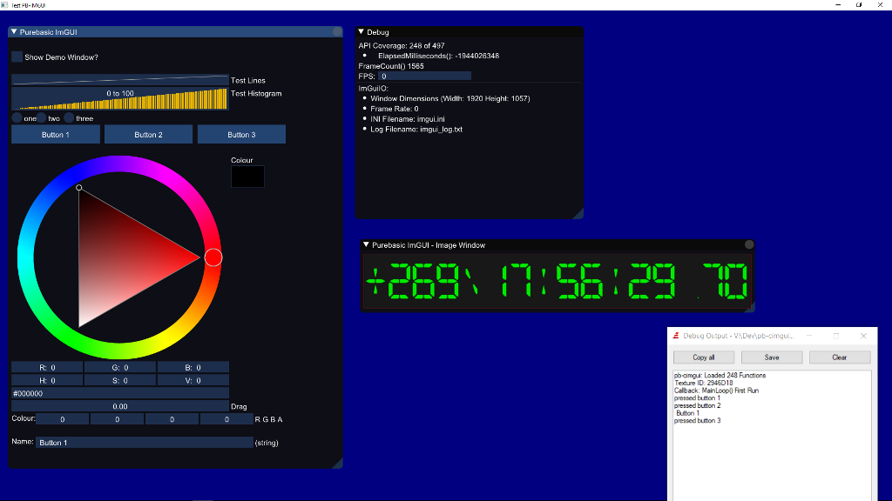

# pb-cimgui 

This is a PureBasic wrapper for CImGui with some helper functions to create a DX11 environment.

Usage:

Use Visual Studio 2015 Community Edition to build the pb-cimgui.dll
Use the pb-cimgui.pbi file in PureBasic to import the DLL functions.

